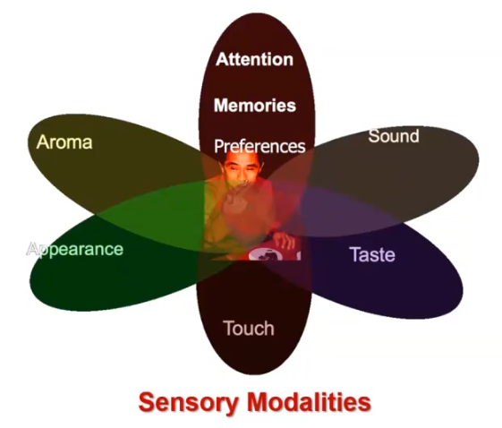
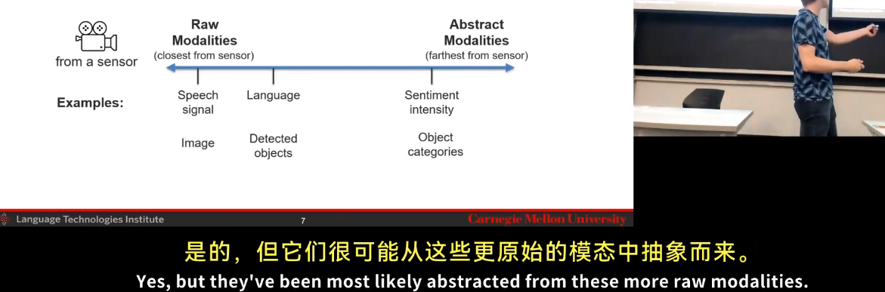
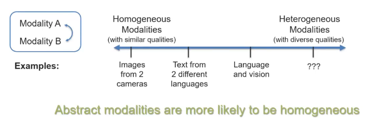

https://www.bilibili.com/video/BV1LwDYYEEFZ/?spm_id_from=333.1387.search.video_card.click&vd_source=0645a76390602d5640c372c2f44d99e1 
## Lecture 1.1: Introduction
What is Multimodal? 
 
Multimodal Behaviors and Signals 
Language 
- Lexicon
  - Words
- Syntax
  - Part-of-speech
  - Dependencies
- Pragmatics
  - Discourse acts
Acoustic 
- Prosody
- Intonation
- Voice quality
- Vocal expression
- Laughter, moans
Visual
- Gestures
  - Head gestures
  - Eye gestures
  - Arm gestures
- Body language
  - Body posture
  - Proxemics
- Eye contact
  - Head gaze
  - Eye gaze
- Facial expressions
  - FACS action units
  - Smile, frowning
Touch
- Haptics
- Motion
Physiological
- Skin conductance
- Electrocardiogram
Mobile
- GPS location
- Accelerometer
- Light sensors
## What is a Modality?、
Modality refers to the way in which something expressed or perceived. 
 
1.A dictionary definition... 
Multimodal:with multiple modalities 
2.A research-oriented definition... 
Multimodal is the scientific study of heterogeneous and interconnected(connected+interacting) data 
## Heterogeneous Modalities 
Information present in different modalities will often show diverse qualities, structures and representations.

