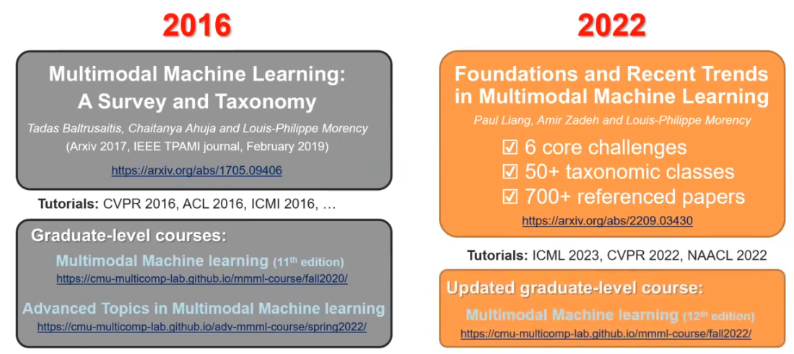
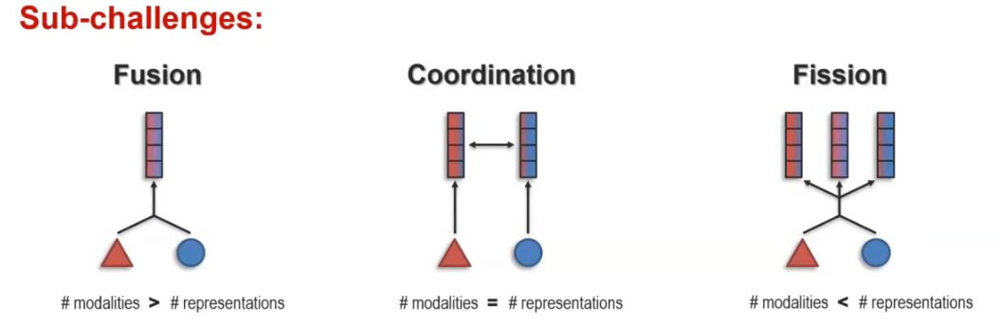

https://www.bilibili.com/video/BV1LwDYYEEFZ/?spm_id_from=333.1387.search.video_card.click&vd_source=0645a76390602d5640c372c2f44d99e1 
## Lecture 1.1: Introduction
What is Multimodal? 
 
Multimodal Behaviors and Signals 
Language 
- Lexicon
  - Words
- Syntax
  - Part-of-speech
  - Dependencies
- Pragmatics
  - Discourse acts
Acoustic 
- Prosody
- Intonation
- Voice quality
- Vocal expression
- Laughter, moans
Visual
- Gestures
  - Head gestures
  - Eye gestures
  - Arm gestures
- Body language
  - Body posture
  - Proxemics
- Eye contact
  - Head gaze
  - Eye gaze
- Facial expressions
  - FACS action units
  - Smile, frowning
Touch
- Haptics
- Motion
Physiological
- Skin conductance
- Electrocardiogram
Mobile
- GPS location
- Accelerometer
- Light sensors
### What is a Modality?、
Modality refers to the way in which something expressed or perceived. 
 
1.A dictionary definition... 
Multimodal:with multiple modalities 
2.A research-oriented definition... 
Multimodal is the scientific study of heterogeneous and interconnected(connected+interacting) data 
### Heterogeneous Modalities 
Information present in different modalities will often show diverse qualities, structures and representations. 
 
A simple example of language and vision. 
At least up to a year ago, many people in AI represent images these days (It changed last year) 
pixel 
more abstracted representation of images: 
Go and take the images, go and get a dense representation, like an autoencoder. 
These days, people are looking, one like autoencoder and one other pixel, for an intermediate between that. It will be a feature space. 
There's different feature space:  
Old school: look at edges and sift features, 2000 
These days: look at images as a list of objects 
Run an object detector and each object will have a dense representation associated with it but really the element the basic element processed is not the pixel but a list of objects. 
When you think of multimodal and you think of a new modality, start thinking what would be that like at home, like that basic element that is going to be meaningful, enough information to be meaningful and that there is enough difference between elements. 
 
Modality change 
 
### Connected Modalities
Connected:Shared information that relates modalities 
Semantic 
The top-down is human-driven like knowledge. 
We establish things, set it to table, decide that there is a correspondent. 
It is h humen-driven of high-level or some knowledge-driven that came in and made this decision.
It's not just that their equivalent synonym, there is a relationship between them. 

### Interacting Modalities
Interacting:process affecting each modality,creating new response 
### Taxonomy of Interaction Responses -A Behavioral Science View

### What is Multimodal Machine Learning?
**Multimodal Machine Learning (ML)** 
 the study of computer algorithms that learn and improve through the use and experience of data from multiple modalities 
**Multimodal Artificial Intelligence (Al)** 
studies computer agents able to demonstrate intelligence capabilities such as understanding,reasoning and planning,through multimodal experiences,and data 
### Multimodal Technical Challenges-Surveys,Tutorials and Courses
 
### Challenge 1:Representation
**Definition**:Learning representations that reflect cross-modal interactions between individual elements,across different modalities
 
### Challenge 2:Alignment
**Definition**:Identifying and modeling cross-modal connections between all elements of multiple modalities,building from the data structure 
->Most modalities have internal structure with multiple elements 
Real goal： to learn a representation that takes into consideration this alignment, this grounding. 
Now these days, people call grounding almost anything that links something to each other, that alignment, that grounding that you have. 
The goal of alignment is the goal of grounding. 
### Challenge 3:Reasoning
Definition:Combining knowledge,usually through multiple inferential steps, exploiting multimodal alignment and problem structure 
 
 
 
### Challenge 4:Generation
**Definition**:Learning a generative process to produce raw modalities that reflects cross-modal interactions,structure and coherence 
 
### Challenge 5:Transference
**Definition**:Transfer knowledge between modalities,usually to help the target modality which may be noisy or with limited resources
 
### Core Multimodal Challenges
 
## Lecture 1.2: Multimodal Research Task

### How Do We Get Research Ideas?
Turn a concrete understanding of existing research's failings to a higher-level experimental question. 
- Bottom-up Discovery of research ideas
- Great tool for incremental progress,but may preclude larger leaps
Move from a higher-level question to a lower-level concrete testing of that question. 
- Top-down Design of research ideas
- Favors bigger ideas,but can be disconnected from reality
**bottom-up discovery:** 
1.Experiment state-of-the-art models 
2.Analyze successes and failures of these models 
3.Identify ways you could improve on these failure cases 
**Top-down Design** 
Brainstorming:Take the time to brainstorm with your teammates, with TAs and with instructors.
- Office hours with TAs these coming 2 weeks
- Project hours with instructors in the next month
- Communicate with us via Piazza!
### Scientific Research Questions and Hypotheses
Research Questions
- One or several explicit questions regarding the thing that you want to know
- Hypotheses are easier to draft with "Yes-no"questions than "how to"questions
Hypothesis:
- What you think the answer to the question may bee a-priori
- Should be falsifiable: if you get a certain result the hypothesis will be validated, otherwise disproved
### Exploratory Research Questions
- These questions will be more open-ended
- This is a valid part of research,but you have to be careful about your conclusion claims
For the course research project,exploratory questions are also good options
### Beware "Does X Make Y Better?""Yes"
The above question/hypothesis is natural,but indirect
e.g. Does cross-attention or transformers improve performance on this dataset.
You should ask these questions: Is capturing cross-modal alignment or is the alignment between modalities really necessary in this particular dataset? 
Then you can falsify, analyze your data, visualize your data to actually see whether the cross-modal alignment is useful in this dataset or not. 
- If the answer is "no" after your experiments, how do you tell what's going wrong? 
Usually you have an intuition about why X will make Y better(not just random) 
Can you think of other research questions/hypotheses that confirm/falsify these assumptions 
### Examples of Research Ideas
Better understanding of the cross-modal interactions in multimodal models
Understanding compositionality and multimodal reasoning
Robustness to missing/noisy modalities,adversarial attacks
Studying social biases and creating fairer models
Interpretable and trustworthy models
Faster and more efficient models for training,storage and inference
Theoretical projects are welcome too
- Make sure that you have experiments to validate and test your theory
Better solutions to existing questions vs defining new research questions 
**the McGurk effect**
The “deep learning” era(2010 s until...) 
Multimodal deep learning [ICML 2011] 
- Multimodal Learning with Deep Boltzmann Machines [NIPS 2012] 
- Visual attention:Show,Attend and Tell:Neural Image Caption 
- Generation with Visual Attention [ICML 2015] 
Key enablers for multimodal research:
- New large-scale multimodal datasets
- Faster computer and GPUS
- High-level visual features
- "Dimensional"linguistic features
### Real world tasks tackled by Multimodal ML
A.Affect recognition
- Emotion
- Personalities
- Sentiment
B.Media description
- Image and video captioning
C.Multimodal QA
- Image and video QA
- Visual reasoning
D.Multimodal Navigation
- Language guided navigation
- Autonomous driving
E.Multimodal Dialog
- Grounded dialog
F.Event recognition
- Action recognition
- Segmentation
G.Multimedia information retrieval
- Content based/Cross-media
### A Curated List of Multimodal Datasets
MOSEI:Sentiment and Emotion (A6)
Social-IQ:Modeling Social Interaction (A10)
MELD:multi-party dialogue and emotions (A11,E)
TVQA:Video Understanding(C7)
NLVR2:Natural Language Grounding Reasoning(C10)
WebQA:Multi-hop visual and test reasoning (C20)
Room-Across-Room:Navigation(D10)
Winoground:Compositionality (D11)
IKEA:multimodal retrieval (G1)
### Some Advice About Multimodal Datasets
- Text,speech,audio,video
  - Space will become an issue working with image/video data
  - Some datasets are in 100s of GB(compressed)
- Memory for processing it will become an issue as well
  - Won't be able to store it all in memory
- Time to extract features and train algorithms will also become an issue
- Plan accordingly!
  - Sometimes tricky to experiment on a laptop(might need to do it on a subset of data)
5/13/2025
## Lecture 2.1:Unimodal Representations

## Lecture 2.2:Unimodal Representations (Part 2)

## Lecture 3.2:Multimodal Representation Fusion

## Lecture 3.2:Multimodal Coordination and Fission

## Lecture 4.1:Multimodal alignment

## Lecture 4.2:Aligned Representations

## Lecture 5.1:Multimodal Transformers(Part 1)

## Lecture 5.2:Structured Representations and Reasoning

