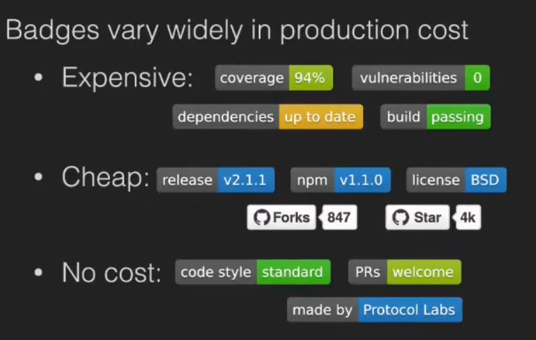
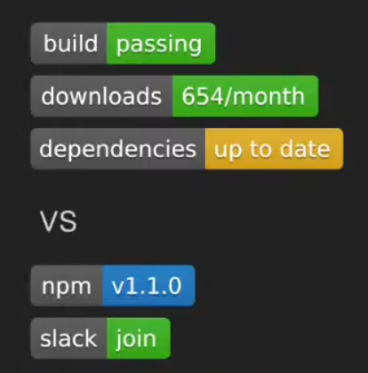
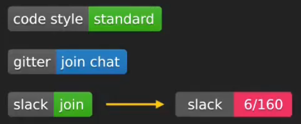

## Formulating Research Questions
- Who are you?
- What is your research?
- What would make this course valuable to you?
## Bogart, et al"How to Break an API"
https://www.researchgate.net/publication/310821510_How_to_break_an_API_cost_negotiation_and_community_values_in_three_software_ecosystems 
- What is the point of this paper?
- What is the methodology?
- 
Why this choice of method?

- Do you trust the results?
- 
Why or why not?

What are the risks of being misled?

How do you evaluate a study with this type of methodology?

What does it tell about other ecosystems?

**Please focus on the bigger picture, on the higher level study design type questions**
It is a very deliberate decision to pick more than one community because they had some hypotheses and assumptions about how this phenomenon they were studying.

It manifests itself differently in different communities.

So they wanted to have some data collected from different communities to be able to compare and understand sort of how these community specific aspects impact the phenomenon that they were studying.

A long term research program in an applied discipline typically involves a mix of both types of questions(knowledge and design).
Activity: in Breakouts, Choose "Best" Method for Answering These Questions

Why do engineers ignore security warnings in their code?

Does test driven development improve code quality?

Which code review tool reveals more bugs?

Do the topics discussed in online technical forums deter the involvement female students?Has this changed since online learning?

How often does this software fail and in what ways? 

## Homework
Topic:using Al to generate programming

source code from natural language

9 months into his PhD

Has built a tool

Needs an evaluation plan

## What Is a Theory?
A theory is a set of propositions that are logically related,expressing the relation(s) among several different constructs and propositions.

Characteristics:

- ldentifies and defines constructs phenomena;
- Makes assertions about their nature;
- Makes assertions about the causal relationships between them;
- Explains why certain relationships occur(good theories).
- 
Theories are the building blocks of scientific knowledge.

They explain how and why certain phenomena occur,and allow prediction.

The more data supporting the theory,the stronger it becomes.

Theories can be:

descriptive(i.e.,naming and characterizing a phenomenon)

explanatory(i.e.,clarifying the relationships between phenomena)

emancipatory (i.e.,articulating the oppression of a people)

disruptive(i.e.,extending existing knowledge or refuting it)

predictive(i.e.,predicting an outcome based on specific inputs)

Theories can also have different levels of explanatory power:

Grand theories:highly abstract;broad natural or social patterns 

Mid-range theories:address more specific aspects of human interactions

Microtheories:focus on individual-level phenomena

Theories Explaining Phenomena Can Compete

## Theoretical Framework
A theoretical framework is a logically developed and connected set of concepts and premises

scaffold a study

1.define any concepts and theories that will provide the grounding of the research

2.unite them through logical connections

3.relate these concepts to the study that is being carried out

## Conceptual Framework
The justification for why a given study should be conducted

(1)describes the state of known knowledge, usually through a literature review

(2)identifies gaps in our understanding of a phenomenon or problem

(3)outlines the methodological underpinnings of the research project

"Why is this research important?"

"What contributions might these findings make to what is already known?"

## How Objective Deductive Researchers Use Theory
simultaneously test a hypothesis derived from theory and the accompanying theory underlying that hypothesis

Theory feature:

(1) testable

(2) be open to being falsified

New knowledge: support, refine, or challenge a theory

Linear progression: theory->hypothesis development->data collection->interpretation of findings->refinement of theory/generation of new causal explanations.

## How Objectivist Deductive Researchers Use a Theoretical Framework
render a theory operational, testable

able to be used to predict, test a hypothesis, or explain a phenomenon

Steps:

1.identify the theory

2.articulate why the current context is a legitimate area of study for that theory

3.shape the constructs of interest

4.articulate the specific language and assumptions of the research question

5.identify the variables and conditions of intertest

6.orient the approach to analysis

## How Objective Deductive Researchers Use a Conceptual Framework
Typical structure

a description of relevant literature

a summary of the relevant theory

an explanation of why this theory could be informative to this context

a specific research methodology adopted

a series of outcomes or variables of interest

- A conceptual framework is finalized before the study and is rarely changed once data collection has started

**The positive worldview with objectivist deductive style research**

## How Subjectivist Inductive Researchers Use Theory

(1)Theory as the product of research

(2)One or more theories informing the research process

theory shapes every stage of the research process, including research questions, data collection, etc.
theory refinement / development may be a major research output.

(3)Theory as an interpretive tool

chosen during data analysis processes to shape the final study interpretations 

may have to modify the data collection and analysis partway as new theory become relevant

## Example Borrowed Theory on Signaling(positivist Stance / Deductive Strategy)
### Signals
- Original idea from evolutionary biology
- Visible clues that imply hidden quality
- Types of signals
Assessment: visible clue cannot be produced without hidden quality

Conventional: meaning is agreeed upon, will continue to exist only if enforced by norms

## Types of Github Badges
- Quality assurance
- 
  Build status, test converage, static analysis, …

- Dependency management

  Version tracking, vulnerability tacking, …

- Information
  
  npm version, license, coding style, release strategy, commit message conventions, …

  ## Conventional Signal VS Assessment Signal Badges
  
 ## Take-Aways (1)
 - Open source developers rely on,and respond to,signals
 - We add both qualitative and quantitative evidence for badges
 ## Take-Aways(2)
 Harder to fake badges provide more reliable signals

 As signaling theory predicts

 

 Redesign badges as assessment signals

 

## Why Build a Tool?
- Build a Tool to Test a Theory

Tool is part of the experimental materials needed to conduct your study
- Build a Tool to Develop a Theory

Theory emerges as you explore the tool
- Build a Tool to Explain your Theory

  Theory as a concrete instantiation of (some aspect of ) the theory  
## Take-Home Messages
Articulate the theory underlying your work

Be precise about your research questions

Be deliberate (and ideally explicit) about your philosophical stance

Use the theory to guide the study design
## Summary
- Without the theory, we have no way of making sense of the accumulation of empirical results. 
An individual study can never offer conclusive results. 
- Theories support analytical generalization 
provide a deeper understanding of our empirical results 
hence know how they apply more generally 
Much more powerful than statistical generalization 
## Strategies To Overcome Weaknesses
Theory-building 
1.Theory-building 
Testing a hypothesis is pointless(single flawed study!) 
unless it **builds evidence for a clearly stated theory** 
2.Empirical induction 
Series of studies over time 
Each designed to probe more aspects of the theory 
together **build evidence for a clearly stated theory** 
3.Mixed-methods research 
Use multiple methods to investigate the same research question 
Each method compensates for the flaws of the others 
together **build evidence for a clearly stated theory**
【【精译⚡软件工程】卡耐基梅隆大学•17-803•2021】 【精准空降到 28:37】 https://www.bilibili.com/video/BV1kvcWecEyU/?p=4&share_source=copy_web&vd_source=e9d67ecc6775d595879efd0a7d60d332&t=1717 

