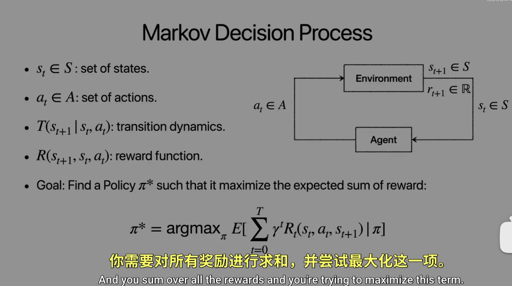
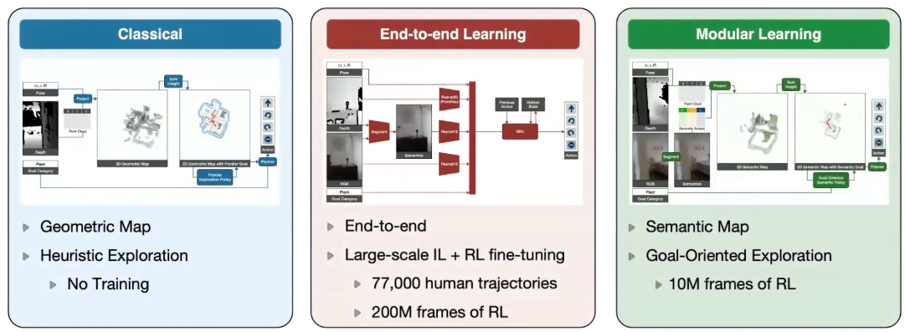

## Common Atomic Manual Actions
Categories
- Pushing Sliding-Object
- Pouring (from one container to another)
- Stirring
- Cutting(w.knife)-vegetables
- Inserting (peg in hole)-lego pieces
- screwing unscrewing-bottle caps
- stacking-blocks plates
- writing-pen/marker （add vision requires 200 milliseconds
- breaking-bread
- painting/wiping
- hammering
- drill
- scissors
- rolling pin
- peeling
- pickup
- putdown
- press -button switch
- pulling handles
- handover
- throw/catch
- hitting with a bat
- hold+translate(for handles of drawers)and
- hold+rotate(for door knobs,handles)
## A book from Noriko Kamakura 
《Postures and movement patterns of the human hand》 
A framework for understanding hand activity and for clinicians and engineers 
She has done the best work in this area of understanding the movements of the hand.
 
 
A very careful study of how we use our hands in daily life 
She made a list of what are common objects and what are common verbs corresponding to common actions 
And then she brought people in the lab and she had this list of common objects and common actions 
Then she had a way of identifying what parts of the hand are touching the object 
Conversational gestures 
Types of gestures: 
- Iconic
- Metaphoric
- Beat
- Deictic
- Cohesive
- Emblem
- Characteristic of an individual speaker.

## how do we use vision to guide action?
## Prediction in goal-directed action
- Prediction allows humans and other animals to prepare for future interactions with their environment.This is important in our dynamically changing world that requires fast and accurate reactions to external events.
- Knowing when and where an event is likely to occur allows us to plan eye,hand,and body movements that are suitable for the circumstances.
- Predicting the sensory consequences of such movements helps to differentiate between self-produced and externally generated movements. 
Our visual systems and motor systems are always adapting.
It is an amazing capability, which would be nice to have in robotics because then you become robust to errors.
## Neuroscience of motor control
- Nikolai Bernstein degrees of freedom problem
- Argued against simplistic reflex models
- Was both an experimentalist and a theoretician 
 
Very likely every CS undergrad has not taken a class on control. 
And the way you encounter control is probably through reinforcement learning 
And reinforcement learning is very fancy mumbo-jumbo. 
You should never learn reinforcement learniing without having studied contro first. 
We have many joints,and these many joints have to be controlled. 
And so therefore,there are many degrees of freedom. 
So, if you want to put it in our jargon of robotics and reinforcement learning, it's a challenge of having lots of degrees of freedom, when you're trying to do reinforcement learning. Reinforcement learning is challenging because of the fact that when you have many degrees of freedom.When you have fewer degrees of freedom, it's not so bad. Because vou're qoing to go exponential in the number of dearees of freedom, And this is wav before any reinforcement learning or anything like that. 
- And this idea in computer vision, we have a version of this, which is the course to find hierarchy. 
 
## Robots that Learn with Reinforcement Learning
reinforcement learning, behavioral, colonial, visual imitations. 
 
 
 

## Behavior cloning
 
## Case Studies in Locomotion
### MPC Model-Predictive Control
Dynamic Arm Swinging is Humans is to save energy 
One of our reward terms for training our model is to minimize energy 
Emergent Terrain Representations 
- Takeaways 
1.A fuul learning-based approach
2.In-context adaptation with Transformers
3.Humanoid locomotion in real-world environments
learning-humanoid-locomotion.github.io 
## Case Studies in Navigation
SLAM is just a renaming of structure for motion
The idea is that if you have multiple images, then you can reconstruct the 3D environment. 
Old techniques are all based on finding corresponding points and doing triangulation. 
The latest techniques involve using learning, where you train on some images and eventually given a set of images, you recover the cameras and then you recover the point cloud of the scene.  
Duster and Muster are examples of that. 
The goal is 3D reconstruction. 
 
quite familiar with semantic SLAM 
 
2. 
- The end-to-end learning is that you are in a simulator
- You have apartments of a type similar to what you're going to encounter in the real world.
- Then you train it in RL or imitation learning way
3. 
Taking the idea of building a map from classical robotics 
But the map is not, you don't do the slam thing of going around everywhere to build a map, you just build a partial map based on the area that you encounter 
 
The the end-to-end learning was an absolute disaster. 
The lesson is that in robotics, you particularly with respect to perception, particularly with respect to vision, training in a simulator doesn't give you enough data to make a really good vision system. 
Vision systems, if you train them with real-world collection of images and video, there is enough diversity to train really good models, then you can use them in a simulator. 
So train in the real for the vision system and then use it in a simulator will work fine. 
【加州大学伯克利分校【中英⚡可学习机器人 CS297 2024 Robots That Learn】】 【精准空降到 37:38】 https://www.bilibili.com/video/BV13HRFYcEg2/?p=12&share_source=copy_web&vd_source=e9d67ecc6775d595879efd0a7d60d332&t=2258 
the video above is pretty great 
 
 
## The multiple spatiotemporal scales
The finest scale can be understood as physical action,but the larger scales are best understood in terms of goals and intentionality 
ACTION=MOVEMENT+GOAL 
## On Mental Models->planning
If the organism carries a small-scale model'of external reality and of its own possible actions within its head,it is able to try out various alternatives,conclude which is the best of them,react to future situations before they arise,utilize the knowledge of past events in dealing with the present and the future,and in every way to react in a
much fuller,safer,and more competent manner to the emergencies which face it(Craik,1943,Ch.5,p.61) 
 
## Long horizon planning
- Classic approach going back to SHAKEY(1971).One designs
operators with precondition lists,delete lists,and add lists,and then planning is a series of calls to these operators with different arguments.
- There is a sophisticated line of work in the Al planning community building on these ideas.PDDL is used
- TAMP (Lozano-Perez and Kaelbling)is in that vein.The task planning part is in that tradition,the motion planning is specific for robotics problems.
- Language models have implicit knowledge of the operators we might use for executing on tasks such as "Make an omelette" 
  "Language is not quite the right way to capture skills." 
  We have low level robotic skills like picking up, throwing, walking, climbing. 
  And these skills are in the space of joint angles and movements or joint angles and movements or joint angles and perception from pixels and so on. 
  Words that don't capture that. 
  But Words are important for capturing high-level goals and plans 

